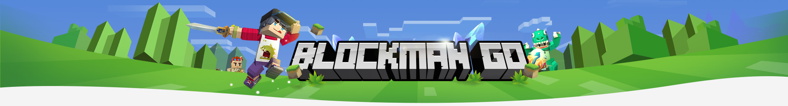

# BlockMan GO



---

## 🎮 Sobre o BlockMan GO
> BlockMan GO é um jogo similar a *Minecraft* e *Roblox*, classificado como *sandbox*, criado pelos desenvolvedores do **BlockMan GO Studio**. Lançado originalmente em *2015*, a ideia principal do jogo era criar uma **plataforma para jogadores se conectarem e jogar online**. Era para ser um **launcher** e **rede social multiplayer**. Os desenvolvedores perceberam que poderiam criar algo apenas deles e decidiram criar o *BlockMan GO: Blocky Mods*, lançado por volta de **2017**.

> Após o lançamento oficial do *BlockMan GO: Blocky Mods*, o jogo ficou muito famoso. Ele era conhecido por ser uma versão gratuita e sem pirataria do *Minecraft*. *BlockMan GO* (Também chamado de *BG* ou *BMGO*), evoluiu e cresceu muito rapidamente. Atualmente, conta com mais de [*100 milhões de instalações na Google Play Store*](https://play.google.com/store/apps/details?id=com.sandboxol.blockymods&hl=pt_BR)

> O *BlockMan GO* teve muita história. Momentos de **alegria**, momentos de **conquista**, momentos de **perda**, momentos de **dificuldades**, assim como todos os jogos. Hoje, o *BlockMan GO* trás **nostalgia** aos *antigos jogadores*, pois enfrenta uma **tremenda dificuldade**. A comunidade era muito forte em **2022**, mas os desenvolvedores simplesmente não dão mais ouvidos aos jogadores. É raro acontecer alguma mudança, e quando acontece, automaticamente dá uma sensação de **nostalgia**. 

> Agora o *BlockMan GO* está em decadência. Precisamos de mais jogadores. Como já havia dito, os desenvolvedores não dão mais atenção ao jogadores. Os YouTubers de *BlockMan GO* (conhecidos como *BGTubers*) pararam. São poucos e pequenos aqueles que permaneceram. O jogo está ficando muito caro, e para completar um simples *evento*, *você* precisa gastar **muito dinheiro**. Mas, felizmente, em minigames que não são necessários a compra de *gcubes (moeda paga do jogo)* está mais fácil para todos jogarem.

> *BlockMan GO* teve seu auge em **2021 a 2022**, durante a pandemia, quando o jogo não era *p2w (Pay 2 Win - "Para para Jogar!)* e todos poderiam se reunir em qualquer jogo, sem muita vantagem nem desvantagem. Todos os minigames eram muito equilibrados, e qualquer pessoa que nunca gastou um centavo no jogo poderia ganhar uma partida facilmente. Hoje a realidade é outra, e é por causa disso que está sofrendo grandes **decadências**. Jogos como *Bed Wars* já estão começando a ficar sem jogadores, e estão migrando para outros jogos como *Roblox* e até mesmo o *Minecraft*.

---

### 📊 Simulação do Gráfico da Decadência
> A seguir, um pequeno gráfico simulando a popularidade do jogo.

---

``` txt
Data                       Jogadores
Abril/2017 - ~45K
Junho/2017 - ~95K
Outubro/2017 - ~115K
Fevereiro/2018 - ~225K
Julho/2018 - ~550K
Novembro/2018 - ~1M
Maio/2019 - ~5M    -> Começo da popularidade
Dezembro/2019 - ~8M
Maio/2020 - ~12M
Novembro/2020 - ~14M
Março/2021 - ~20M
Setembro/2021 - ~40M
Abril/2022 - ~50M
Agosto/2022 - ~70M
Dezembro/2023 - ~100M
Janeiro/2024 - ~80M    -> Começo da Decadência
Junho/2024 - ~68M
Dezembro/2024 - ~30M
Abril/2025 - ~15M
Outubro/2025 - ~8M
... Decadência Esperada
```

---

## ℹ️ Sobre o site
> Este site **não foi desenvolvido pela equipe do BlockMan GO**, mas sim por um *fã, que joga há muito tempo atrás*. Foi desenvolvido apenas para fins educacionais, sem fins comerciais nem de distribuição. Por favor, se você tem os devidos *direitos autorais*, **peça a remoção via as *issues* do GitHub.**

> As imagens obtidas aqui foram resultados de pesquisas na *Internet*, e não tem em hipotése alguma obter lucro sobre isso. Meu único objetivo por trás deste site é atrair mais jogadores ao jogo, crescer novamente e reviver a comunidade perdida. Quanto mais repercusão, mais chances da *equipe do BlockMan GO* trazer novos conteúdos legais e livres para todos.

---

## 🌃 O futuro do jogo
> Como você viu anteriormente, o *BlockMan GO* está um declínio. Cada dia mais menos pessoas se interessam. Este site tem como objetivo *trazer novos jogadores ao jogo*. Porém, se os desenvolvedores continuarem do jeito que estão atualmente, o jogo pode ter uma grande possível falha e queda. Nós como antigos jogadores, jamais queremos que isso aconteça. Esse não é apenas um jogo, é parte de uma vida, é uma história vivida há anos atrás.

---

## 🎉 Agradecimentos
> Muito obrigado se chegou até aqui! Se você nunca jogou e se interessou pelo jogo, faça o *download* agora por meio do [Google Play Store](https://play.google.com/store/apps/details?id=com.sandboxol.blockymods&hl=pt_BR) ou da [App Store](https://apps.apple.com/br/app/blockman-go/id1426189000). Espero que goste de jogo, e muito obrigado por ergue-lo denovo!
> #BlockManGOEternal

---
